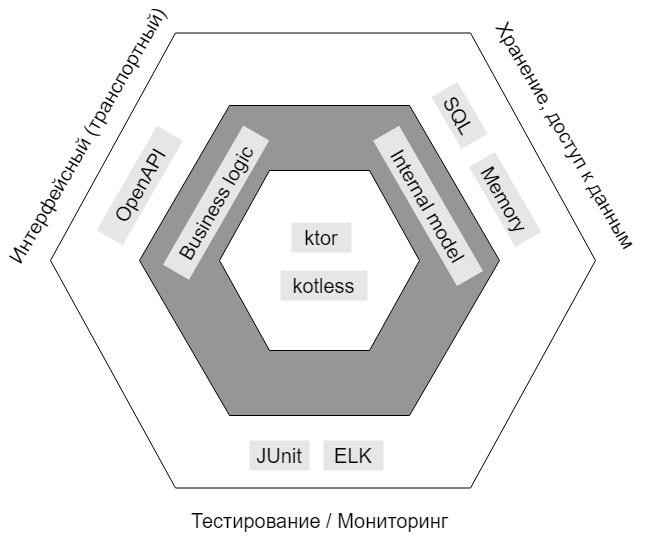

# Объявления	услуги
Сервис для создания и временного хранения объявлений услуг. Объявление — это краткое изложение основной информации об услуге, которое способствует привлечению новых клиентов. У объявления может быть выставлены характеристики услуги (описание, цена, и т.д.), а также возможность получить контакты для связи.

## Целевая аудитория
Владельцы и разработчики веб-ресурсов, имеющие авторизованных пользователей через Телеграм или Вконтакте

### Портрет клиентов
- архитектор или руководитель группы разработчиков, который ищет оптимальное решение для быстрого создания MVP;
- опытный разработчик небольшого проекта, стартапа;
- компания/разработчик типовых/серийных проектов (бот, канал/группа, блог/сайт);
- фронт разработчики с минимальными знаниями в бэкэнде (мобильные приложения, сайты).

## Описание MVP
Разработчик имеет возможность использовать CRUDS-операции сервиса Объявления услуг. Поиск по категориям, ключевым словам. Наличие базы данных позволяет объявлениям храниться в базе данных определенный период.
Пользователь-автор имеет возможность создавать, редактировать, удалять объявление услуги. Пользователь-соискатель имеет возможность получать список объявлений, контакты для связи из объявления.

### Эскиз фронтенд-представления
|                                                                                                           |                                                                       |                                    |
|:---------------------------------------------------------------------------------------------------------:|:---------------------------------------------------------------------:|:----------------------------------:|
| | |  |

## Описание сущностей приложения
Ad (сокр. от advertisement - объявление)
### Ad 
1. id
2. category
3. title
4. description
5. price
6. phone
7. dateCreate
8. telegramId
9. vkId
10. contactType

## Архитектурная диаграмма

